<div align="center">

# cortex

### Browser-Native AI Gateway With an OpenAI-Compatible API

<p>
  Self-hosted gateway for <b>Grok</b>, <b>Gemini</b>, and <b>ChatGPT</b>, powered by persistent Playwright browser sessions, operator-managed provider logins, API key governance, and a built-in admin platform.
</p>

<p>
  <a href="https://github.com/Th3X-Zohir/cortex"></a>
  
  
  
  
</p>

<p>
  
  
  
  
</p>

</div>

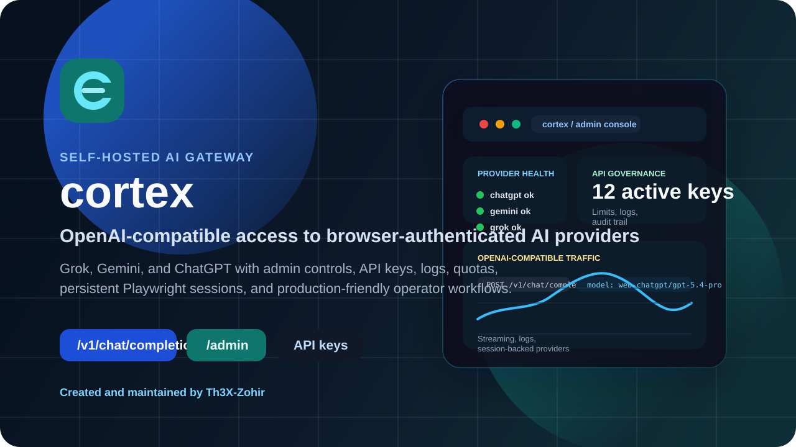

<p align="center">
  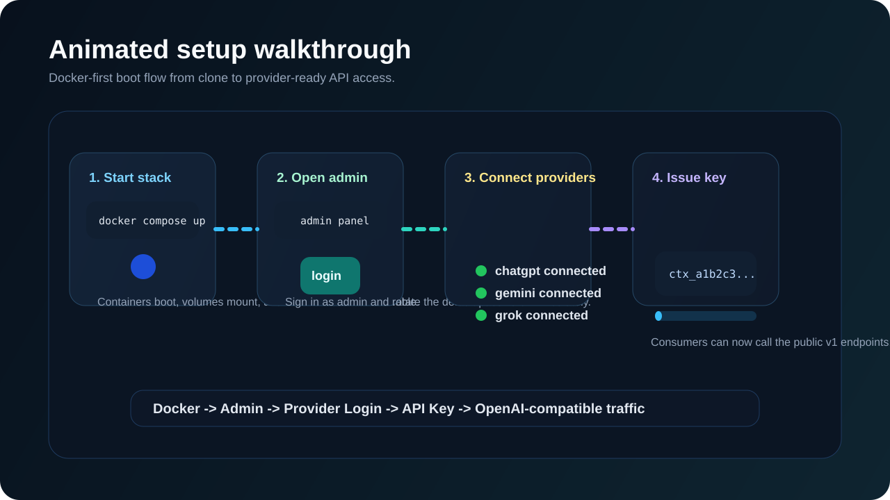
</p>

---

## Overview

`cortex` is a self-hosted AI gateway that exposes browser-authenticated providers through an OpenAI-compatible HTTP API.

Instead of relying only on official provider APIs, `cortex` drives real provider web apps through Playwright and keeps those sessions persistent on disk. That gives you one service boundary for:

- OpenAI-style client compatibility
- central operator-managed provider login
- API key issuance and quota enforcement
- request logging and usage visibility
- admin UI and admin API control
- Docker-friendly deployment

This repository currently supports **registered runtime providers** for:

- `grok`
- `gemini`
- `chatgpt`

Implementations for `claude` and some API-based providers exist in the repo, but they are **not currently registered in the active provider registry** and should not be presented as live support.

---

## Visual Snapshot

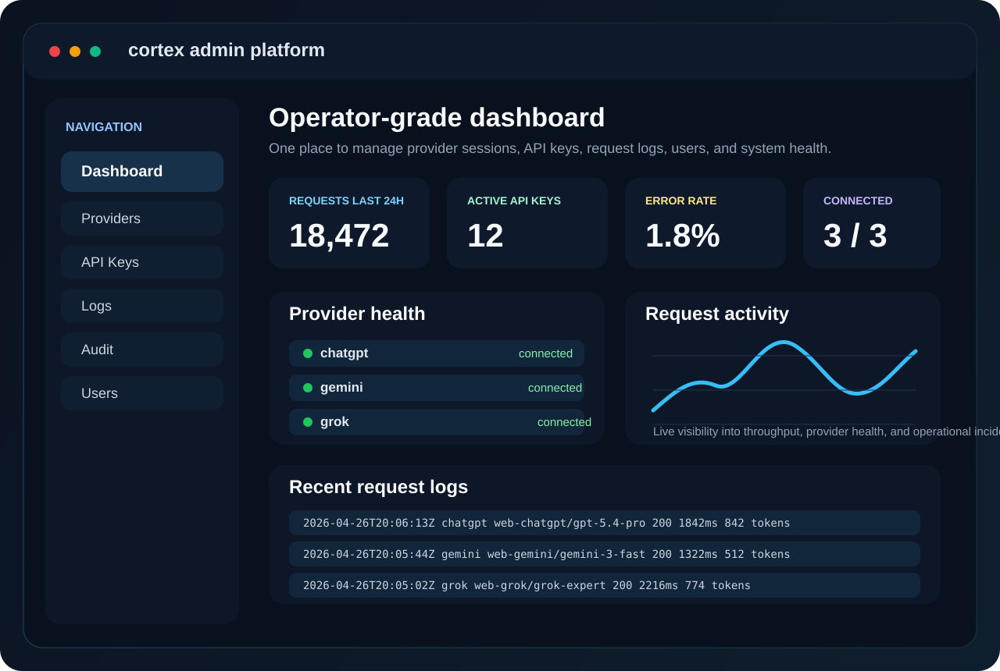

<table>
  <tr>
    <td width="25%" valign="top">
      <h3>Gateway Layer</h3>
      <p>One endpoint for client apps, one auth model for consumers, one operational surface for maintainers.</p>
    </td>
    <td width="25%" valign="top">
      <h3>Stateful Runtime</h3>
      <p>Persistent browser profiles allow providers to stay connected across restarts and maintenance windows.</p>
    </td>
    <td width="25%" valign="top">
      <h3>Operator Toolkit</h3>
      <p>Admins, API keys, logs, quotas, provider controls, user requests, and audit trails are part of the product surface.</p>
    </td>
    <td width="25%" valign="top">
      <h3>Deployment Ready</h3>
      <p>Docker, noVNC, reverse-proxy friendliness, and persistent storage patterns make self-hosting practical.</p>
    </td>
  </tr>
</table>

<table>
  <tr>
    <td width="33%" valign="top">
      <h3>Unified API</h3>
      <p>Point OpenAI-compatible clients at one base URL and switch provider behavior with the <code>model</code> field.</p>
    </td>
    <td width="33%" valign="top">
      <h3>Operator Control</h3>
      <p>Use the admin panel to connect providers, issue API keys, inspect logs, manage admins, and monitor usage.</p>
    </td>
    <td width="33%" valign="top">
      <h3>Browser-Backed</h3>
      <p>Persistent Chromium sessions let the service work through real provider web experiences rather than thin request translation alone.</p>
    </td>
  </tr>
</table>

### At a Glance

| Area | What You Get |
| --- | --- |
| API Layer | `POST /v1/chat/completions`, `GET /v1/models`, `GET /v1/status`, `GET /health` |
| Auth Model | API keys for public consumers, JWT for admin operators |
| Persistence | SQLite for admin data, filesystem profiles for provider browser sessions |
| Controls | Admins, API keys, users, user key requests, logs, audit logs, stats |
| Runtime | Node 20+, Playwright, Chromium, Docker, noVNC/VNC |

---

## Why It Looks Different

Most “OpenAI-compatible” projects stop at request translation.

`cortex` is materially different because it combines:

- browser-authenticated provider sessions
- a public OpenAI-style API surface
- a private operator control plane
- persistent runtime state
- quota and audit governance

That makes it less like a thin proxy and more like a small AI access platform.

### Conceptual Stack

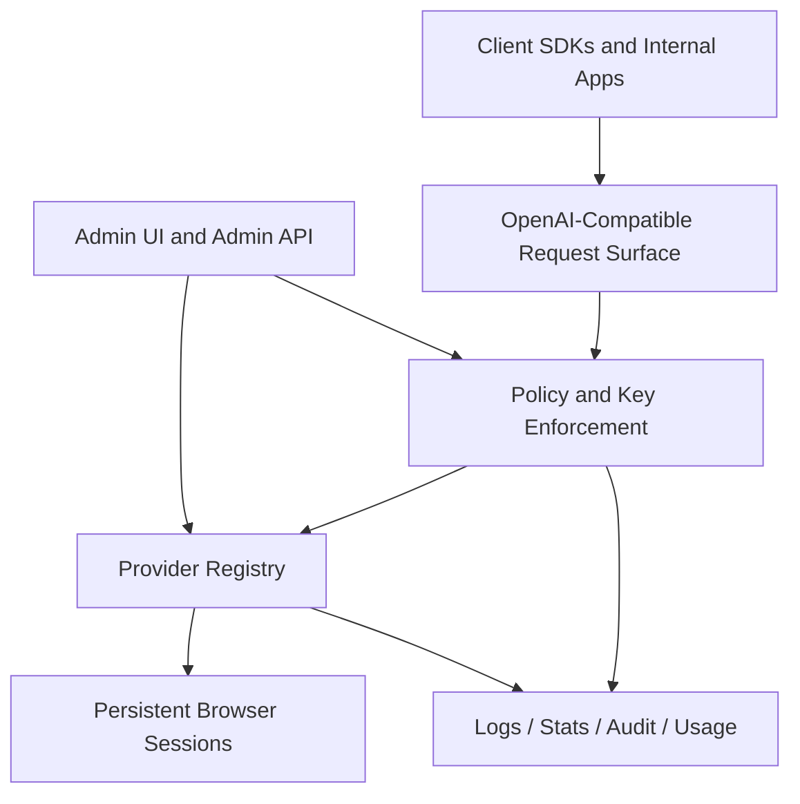

---

## Architecture

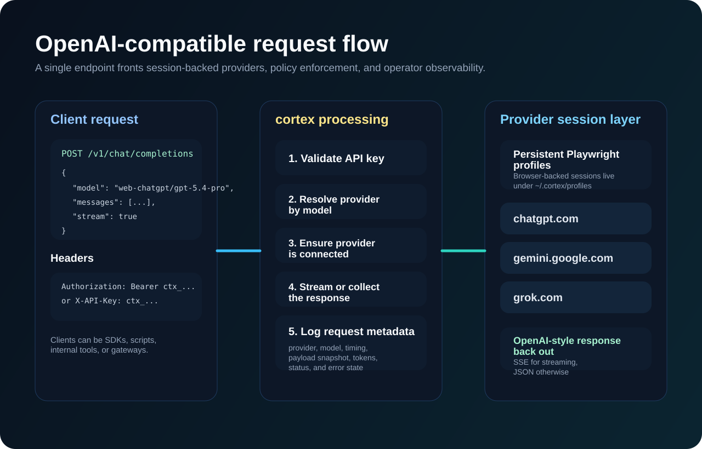

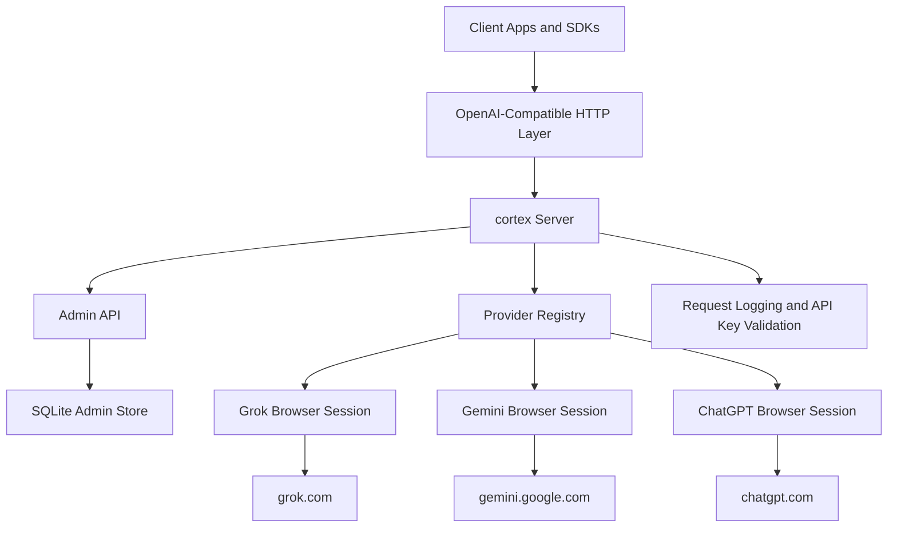

### Request Lifecycle

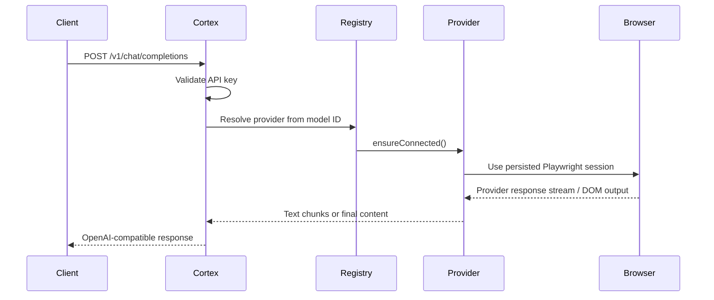

### Operator Flow

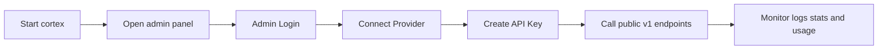

### Infrastructure Topology

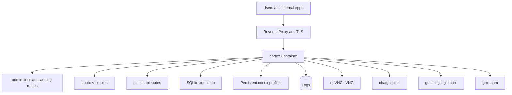

### Control Plane vs Data Plane

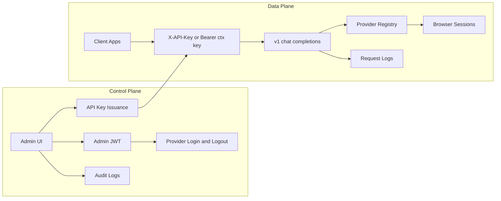

---

## Why This Project Exists

Many teams want a single AI gateway for internal tools, scripts, automations, and dashboards, but do not want to wire each provider separately or depend on several downstream auth flows.

`cortex` gives you:

- one service boundary
- one authentication model for consumers
- one admin console for operators
- one place to inspect health, usage, and failures

It is especially useful when you want to:

- expose a local or internal OpenAI-compatible endpoint
- manage browser-authenticated providers centrally
- provide controlled access to multiple users or teams
- keep auditability and rate limits under your own infrastructure

---

## Why Open Source

Open-sourcing a project like `cortex` is valuable because users can inspect the exact trust boundary.

That matters here because the project touches:

- authentication
- browser automation
- provider session persistence
- API key enforcement
- request logging
- operator permissions

An open repository helps users evaluate:

- how sessions are persisted
- what the admin surface can do
- what the logging layer stores
- what is actually supported at runtime
- where the limits and risks are

For this type of infrastructure, transparency is a feature.

---

## Feature Matrix

| Capability | Status | Notes |
| --- | --- | --- |
| OpenAI-compatible chat completions | Yes | `POST /v1/chat/completions` |
| Model listing | Yes | `GET /v1/models` |
| Provider status reporting | Yes | `GET /v1/status` |
| Public API key enforcement | Yes | Enabled by default |
| Daily quotas and per-minute rate limits | Yes | Enforced per API key |
| Admin web UI | Yes | Served from `/admin` |
| Admin API | Yes | Under `/api/*` |
| Request logs | Yes | Includes payload snapshots and token estimates |
| Audit logs | Yes | Tracks operator actions |
| User registration and key-request workflows | Yes | Present in current admin backend |
| Docker / noVNC / VNC | Yes | Included in container setup |
| Registered Claude runtime support | No | Code exists, not active in registry |

---

## Comparison

### `cortex` vs common alternatives

| Dimension | `cortex` | Official Provider APIs | Thin Reverse Proxy | LiteLLM-style API Router |
| --- | --- | --- | --- | --- |
| Browser-authenticated provider access | Yes | No | No | No |
| OpenAI-compatible surface | Yes | Sometimes | Depends | Yes |
| Built-in admin UI | Yes | No | No | Usually no |
| API key governance for your own consumers | Yes | Limited to provider model | Usually no | Sometimes |
| Provider session persistence | Yes | Not applicable | No | No |
| Audit and operator workflows | Yes | Provider-owned | Usually no | Limited |
| Works well with serverless platforms | No | Yes | Sometimes | Sometimes |
| Stateful self-hosting orientation | Yes | No | Rarely | Moderate |

### What `cortex` is optimized for

- self-hosted control
- stateful provider access
- operator governance
- internal platform use
- browser-backed compatibility where official APIs are not the whole story

### What `cortex` is not optimized for

- serverless deployment
- zero-state edge hosting
- fully stateless autoscaling
- pretending browser-backed runtime behaves exactly like official provider APIs

---

## Current Runtime Support

This section reflects the code as it exists now.

### Registered Providers

These are currently instantiated in [src/registry.ts](/D:/Jihan/cortex/src/registry.ts):

| Provider | Runtime Status | Auth Mode |
| --- | --- | --- |
| `grok` | Active | Browser session |
| `gemini` | Active | Browser session |
| `chatgpt` | Active | Browser session |

### Present in Code But Not Registered

| Provider | State |
| --- | --- |
| `claude` | Implemented, not active in runtime registry |
| `claude-api` | Implemented, not active in runtime registry |
| `gemini-api` | Implemented, not active in runtime registry |
| `codex-api` | Implemented, not active in runtime registry |

### Current Model IDs

#### Grok

- `web-grok/grok-expert`
- `web-grok/grok-fast`
- `web-grok/grok-heavy`
- `web-grok/grok-4.20-beta`

#### Gemini

- `web-gemini/gemini-3-fast`
- `web-gemini/gemini-3-thinking`
- `web-gemini/gemini-3.1-pro`

#### ChatGPT

- `web-chatgpt/gpt-5.4-pro`
- `web-chatgpt/gpt-5.4-thinking`
- `web-chatgpt/gpt-5.3-instant`
- `web-chatgpt/gpt-5-thinking-mini`
- `web-chatgpt/o3`

Always treat `GET /v1/models` as the source of truth for a running instance.

---

## Screens You Effectively Get

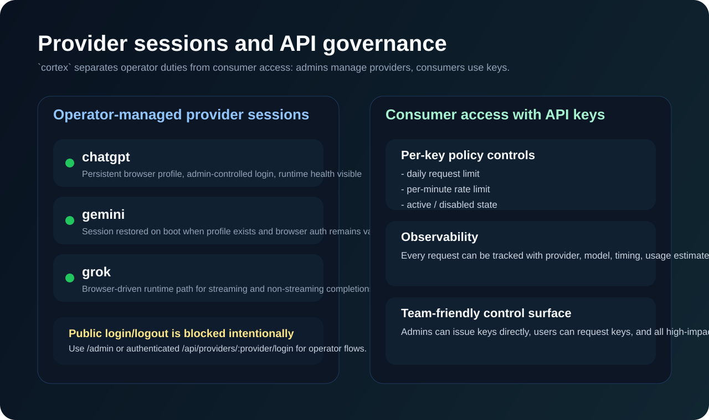

Even without publishing screenshots in this repository yet, the project already ships these operational surfaces:

- **Admin dashboard** for service visibility
- **Provider controls** for login/logout and connection state
- **API key management** with quotas and limits
- **Usage and stats** views
- **Request log inspection**
- **Audit log review**
- **User and key-request management**

If you want, the next iteration can include actual PNG screenshots or animated GIF sections once you add image assets to the repo.

### Recommended Open-Source Visual Pack

If you want to make the repository look even more premium after this pass, the best additions would be:

- real screenshots exported from the running admin dashboard
- a short animated GIF showing provider login, key creation, and a successful `/v1/chat/completions` request
- an architecture PNG for marketplaces or social previews
- a dark social card for GitHub and X sharing

This README now includes repo-local branded visuals and animated SVG walkthroughs, but captured product GIFs would still be the highest-fidelity next step.

---

## Product Surface Map

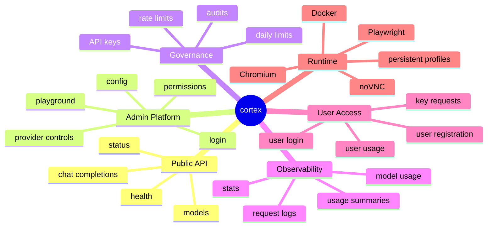

---

## Quick Start

### Docker-first setup

For users of this repository, the recommended setup path is Docker. This project depends on Playwright, Chromium, persistent browser profiles, and remote login workflows, so containerized deployment is the cleanest default.

### Prerequisites

- Docker
- Docker Compose
- provider credentials for the accounts you want to connect
- a machine or VM where persistent storage is available

### Start with Docker Compose

```bash
git clone https://github.com/Th3X-Zohir/cortex.git
cd cortex
docker compose up --build -d
```

### Open the service

- App / landing: `http://localhost:31339`
- Admin panel: `http://localhost:31339/admin/`
- noVNC: `http://localhost:31339/novnc/vnc.html`

### Default bootstrap admin

On first boot, unless overridden:

- username: `admin`
- password: `admin`

Change them immediately.

---

## First-Time Setup Walkthrough

### 1. Launch the stack

```bash
docker compose up --build -d
```

### 2. Open the admin panel

Visit:

```text
http://localhost:31339/admin/
```

### 3. Change the default admin password

Do this before exposing the instance to any shared network or internet-facing environment.

### 4. Connect providers through the admin controls

Use the authenticated admin provider controls to connect:

- `grok`
- `gemini`
- `chatgpt`

Important:

- browser login is managed through the admin surface
- `POST /v1/login/:provider` is intentionally blocked with `403`
- `POST /v1/logout/:provider` is intentionally blocked with `403`

That behavior is implemented in [src/server.ts](/D:/Jihan/cortex/src/server.ts).

### 5. Create one or more API keys

Use the admin panel or admin API to issue a consumer key.

### 6. Verify health and model availability

```bash
curl http://localhost:31339/health
curl http://localhost:31339/v1/models -H "X-API-Key: YOUR_KEY"
curl http://localhost:31339/v1/status -H "X-API-Key: YOUR_KEY"
```

### 7. Send a test completion

```bash
curl http://localhost:31339/v1/chat/completions \
  -H "Content-Type: application/json" \
  -H "X-API-Key: YOUR_KEY" \
  -d '{
    "model": "web-chatgpt/gpt-5.4-pro",
    "messages": [
      { "role": "system", "content": "You are concise." },
      { "role": "user", "content": "Say hello in one sentence." }
    ],
    "stream": false
  }'
```

---

## Public API

Base URL by default:

```text
http://localhost:31339
```

### Authentication

Public `/v1` routes require an API key by default.

Supported headers:

```http
X-API-Key: ctx_...
```

or

```http
Authorization: Bearer ctx_...
```

### Endpoints

| Endpoint | Method | Auth | Purpose |
| --- | --- | --- | --- |
| `/health` | `GET` | No | Liveness check |
| `/v1/models` | `GET` | Yes by default | Runtime model list |
| `/v1/status` | `GET` | Yes by default | Provider and service status |
| `/v1/chat/completions` | `POST` | Yes by default | OpenAI-compatible chat |

### Intentionally Forbidden Public Routes

| Endpoint | Status | Reason |
| --- | --- | --- |
| `/v1/login/:provider` | `403` | Provider login is an operator action |
| `/v1/logout/:provider` | `403` | Provider logout is an operator action |

### Example: `GET /health`

```json
{
  "status": "ok",
  "service": "cortex",
  "version": "0.2.0"
}
```

### Example: `GET /v1/models`

```json
{
  "object": "list",
  "data": [
    {
      "id": "web-chatgpt/gpt-5.4-pro",
      "object": "model",
      "created": 0,
      "owned_by": "openai"
    }
  ]
}
```

### Example: `POST /v1/chat/completions`

Request:

```json
{
  "model": "web-grok/grok-expert",
  "messages": [
    { "role": "system", "content": "You are concise." },
    { "role": "user", "content": "Summarize this project." }
  ],
  "stream": false,
  "newConversation": true
}
```

Response:

```json
{
  "id": "chatcmpl-1713360000000",
  "object": "chat.completion",
  "model": "web-grok/grok-expert",
  "choices": [
    {
      "index": 0,
      "message": {
        "role": "assistant",
        "content": "A self-hosted OpenAI-compatible gateway for browser-backed AI providers."
      },
      "finish_reason": "stop"
    }
  ],
  "usage": {
    "prompt_tokens": 42,
    "completion_tokens": 18,
    "total_tokens": 60
  }
}
```

### Streaming

If `stream: true`, the service returns SSE.

<p align="center">
  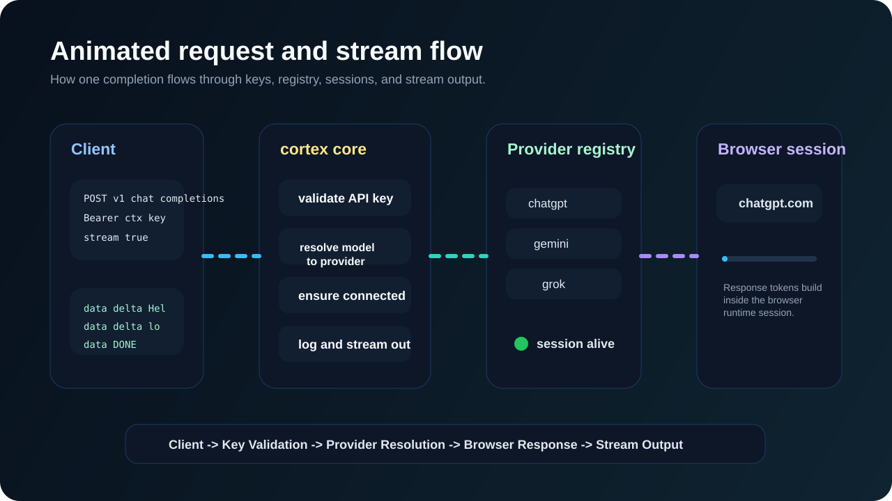
</p>

```text
data: {"id":"chatcmpl-...","object":"chat.completion.chunk","model":"web-chatgpt/gpt-5.4-pro","choices":[{"index":0,"delta":{"content":"Hello"},"finish_reason":null}]}

data: {"id":"chatcmpl-...","object":"chat.completion.chunk","model":"web-chatgpt/gpt-5.4-pro","choices":[{"index":0,"delta":{},"finish_reason":"stop"}],"usage":{"prompt_tokens":42,"completion_tokens":10,"total_tokens":52}}

data: [DONE]
```

Notes:

- usage is included in the terminal chunk
- some chunks may include `cortex_meta`
- provider failures can surface in-stream

### Contract Summary

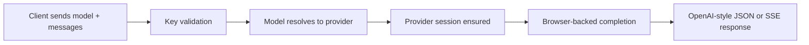

---

## Admin API

The authenticated operator API lives under `/api/*` and is implemented in [src/admin/api.ts](/D:/Jihan/cortex/src/admin/api.ts).

### Authentication Flow

1. `POST /api/auth/login`
2. Receive admin JWT
3. Send `Authorization: Bearer <token>` on later admin requests

### Important Admin Endpoints

| Endpoint | Method | Purpose |
| --- | --- | --- |
| `/api/auth/login` | `POST` | Admin login |
| `/api/auth/logout` | `POST` | Admin logout |
| `/api/auth/me` | `GET` | Current admin identity and permissions |
| `/api/admin/permissions` | `GET` | Effective permissions |
| `/api/providers/status` | `GET` | Provider session health |
| `/api/providers/models` | `GET` | Models plus usage and status |
| `/api/providers/:provider/login` | `POST` | Start provider browser login |
| `/api/providers/:provider/logout` | `POST` | Disconnect provider |
| `/api/playground/chat` | `POST` | Admin chat playground |
| `/api/admin/keys` | `GET`, `POST` | List or create API keys |
| `/api/logs` | `GET` | Request logs |
| `/api/audit-logs` | `GET` | Audit events |
| `/api/stats` | `GET` | Dashboard stats |
| `/api/config` | `GET`, `POST` | Runtime config |
| `/api/admin/admins` | `GET`, `POST` | Admin management |
| `/api/admin/users` | `GET` | User listing |
| `/api/admin/user-requests` | `GET` | API key request review |

### User-Facing Backend Routes Also Present

The current codebase also includes:

- `POST /api/user/register`
- `POST /api/user/login`
- `GET /api/user/me`
- `POST /api/user/logout`
- `GET /api/user/keys`
- `POST /api/user/keys/request`
- `GET /api/user/keys/requests`
- `GET /api/user/usage`
- `GET /api/user/logs`

### Admin Capability Breakdown

| Area | Capabilities |
| --- | --- |
| Provider operations | connect, disconnect, inspect runtime availability |
| Consumer governance | create keys, set limits, disable keys, inspect usage |
| Security operations | manage admins, roles, permissions, password changes |
| User lifecycle | register users, review key requests, issue access |
| Platform visibility | logs, stats, audits, model usage, provider status |

---

## Configuration

Primary config file:

```text
~/.cortex/config.json
```

### Default Config Shape

```json
{
  "port": 31338,
  "host": "0.0.0.0",
  "profileBaseDir": "~/.cortex/profiles",
  "headless": false,
  "logLevel": "info",
  "apiKeys": {},
  "admin": {
    "dbPath": "~/.cortex/admin.db",
    "tokenTtlSeconds": 28800,
    "requireApiKey": true,
    "logRetentionDays": 90,
    "corsOrigin": "*"
  }
}
```

### Environment Variables Read Directly by Current Code

| Variable | Purpose |
| --- | --- |
| `CORTEX_ADMIN_DB` | SQLite admin DB path |
| `CORTEX_ADMIN_JWT_SECRET` | Admin JWT signing secret |
| `CORTEX_ADMIN_TOKEN_TTL_SECONDS` | JWT TTL |
| `CORTEX_REQUIRE_API_KEY` | Set `false` to disable public API key enforcement |
| `CORTEX_LOG_RETENTION_DAYS` | Default retention for logs |
| `CORTEX_CORS_ORIGIN` | CORS allow-origin |
| `CORTEX_ADMIN_USERNAME` | Initial admin username |
| `CORTEX_ADMIN_PASSWORD` | Initial admin password |

### Runtime Controls

For `port`, `host`, `headless`, and `logLevel`, the supported paths are:

- CLI flags such as `cortex start --port=31338 --host=0.0.0.0`
- persisted config in `~/.cortex/config.json`

### Configuration Philosophy

`cortex` is opinionated about a few things:

- public API key enforcement should be on by default
- persistent state matters
- admin and consumer concerns should be separated
- deployment should favor stateful container or VM environments
- operator convenience should not hide actual runtime constraints

---

## Security Model

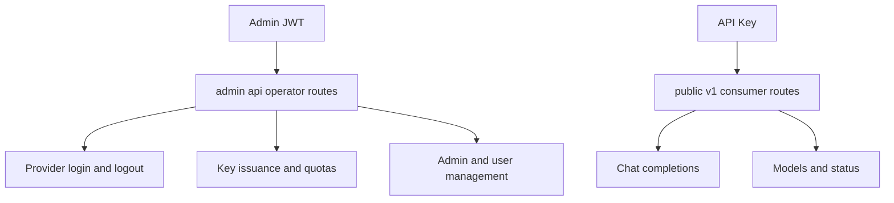

---

## CLI

```bash
cortex start [--port=31338] [--host=0.0.0.0] [--log-level=info] [--headless=false]
cortex status [--api-key <ctx_...>]
cortex config
cortex config <key> <value>
```

Important note:

- `cortex login <provider>` appears in the CLI code/help path
- the current server implementation intentionally blocks public `/v1/login/:provider`
- for real operations, use the admin panel or the authenticated admin provider endpoints

---

## Storage and Persistence

Typical runtime layout:

```text
~/.cortex/
├── admin.db
├── admin-jwt-secret
├── config.json
├── profiles/
│   ├── grok-profile/
│   ├── gemini-profile/
│   └── chatgpt-profile/
├── grok-expiry.json
├── gemini-expiry.json
└── chatgpt-expiry.json
```

Other runtime artifacts can include:

```text
logs/
dist/
admin/dist/
data/
```

Persisting `~/.cortex` is mandatory if you want:

- browser sessions to survive restarts
- admin data to survive restarts
- API keys and quotas to survive restarts
- logs and operational history to survive restarts

---

## Docker Deployment

This repository includes:

- [Dockerfile](/D:/Jihan/cortex/Dockerfile)
- [docker-compose.yml](/D:/Jihan/cortex/docker-compose.yml)
- [nginx/default.conf](/D:/Jihan/cortex/nginx/default.conf)
- [docker-entrypoint.sh](/D:/Jihan/cortex/docker-entrypoint.sh)

### Container Stack Characteristics

- Node 20 runtime
- Playwright Chromium installation
- Xvfb
- x11vnc
- noVNC and websockify
- remote desktop flow for browser login inside the container

### Compose Summary

Current compose behavior:

- `cortex` exposes internal `31338`, `5900`, `6080`
- `cortex-proxy` publishes `31339`
- nginx fronts the application on port `31339`
- a named volume persists `~/.cortex`

Start with:

```bash
docker compose up --build
```

Access:

```text
http://localhost:31339
```

### Direct Image Build

```bash
docker build -t cortex .
docker run -p 31338:31338 -p 5900:5900 -p 6080:6080 cortex
```

### Persistent data you should mount

At minimum, persist:

- `~/.cortex` or the equivalent container path storing provider browser profiles
- SQLite/admin storage
- logs

Without persistence, browser logins and operational state will be lost on redeploy.

### Containerized Operations Model

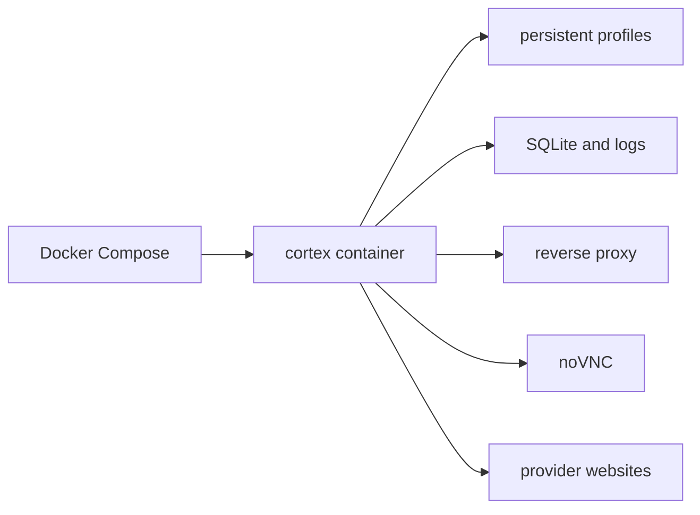

---

## Production Guidance

### Minimum Hardening Checklist

- set `CORTEX_ADMIN_PASSWORD` before first boot
- set `CORTEX_ADMIN_JWT_SECRET`
- keep API key enforcement on
- issue separate keys per consumer or team
- set daily and per-minute quotas
- persist `~/.cortex`
- persist logs and SQLite state
- front the service with HTTPS
- restrict admin access by IP, VPN, reverse proxy auth, or private network
- monitor logs, audit logs, and provider health

### Operational Reality

This project depends on real provider web surfaces. That means:

- providers can change their UI
- sessions can expire
- anti-abuse systems can interrupt flows
- browser automation may require maintenance

Treat provider adapters as integrations that need upkeep.

### Recommended deployment targets

Good fits for this architecture:

- VPS providers such as Hetzner, DigitalOcean, Linode, OVH
- cloud VMs such as AWS EC2, Google Compute Engine, Azure VM
- container hosts such as Fly.io Machines, Render background services with persistent disk if browser/runtime constraints are satisfied, self-managed Docker hosts
- Kubernetes if you are willing to handle persistent volumes, ingress, and browser runtime dependencies carefully

Best default recommendation:

- a Linux VPS with Docker Compose
- persistent volume for `~/.cortex`
- nginx, Caddy, or Traefik in front for HTTPS

### Vercel guidance

**Vercel is not a good deployment target for `cortex`.**

Reason:

- this project is a long-running server, not a serverless edge function
- it requires persistent browser profiles
- it depends on Playwright/Chromium runtime behavior
- it benefits from VNC/noVNC and stateful disk persistence

If you want a hosted deployment, use a VPS or stateful container host instead of Vercel.

### Simple production topology

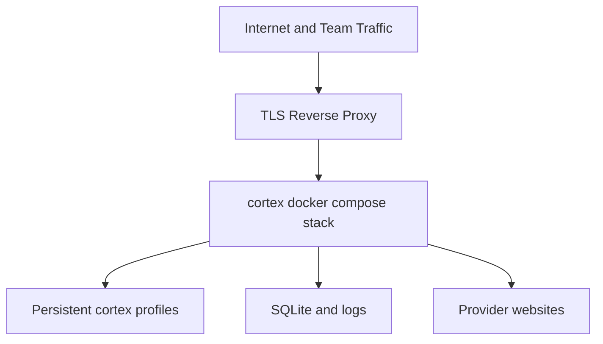

### Deployment checklist

1. Provision a Linux host with Docker and Docker Compose.
2. Clone the repository.
3. Set strong admin credentials and secrets before first boot.
4. Mount persistent storage for profiles and data.
5. Run `docker compose up --build -d`.
6. Put HTTPS in front of the stack.
7. Restrict `/admin` and `/api` to trusted operators where possible.
8. Log into providers through admin controls.
9. Issue API keys and configure quotas.
10. Monitor logs, usage, and provider session health.

### Example reverse proxy strategy

Recommended frontends:

- **Caddy** for simple automatic HTTPS
- **nginx** for full control
- **Traefik** if you already run container-based routing

Suggested routing model:

- `/` -> public landing/docs
- `/v1/*` -> public API behind API key auth
- `/admin/*` -> operator UI
- `/api/*` -> operator backend
- `/novnc/*` -> remote browser access for login workflows

### Deployment patterns by scale

| Pattern | Best For | Notes |
| --- | --- | --- |
| Single VPS + Docker Compose | Most users | Simplest and recommended |
| VM + external reverse proxy | Teams | Cleaner TLS and networking separation |
| Kubernetes | Advanced operators | More moving parts, only worth it if you already run K8s |
| Vercel | Not recommended | Stateless/serverless model conflicts with project needs |
| GitHub Codespaces | Temporary demo only | Not a production deployment |

### Recommended Release Story For Users

If you want the repository to convert better for open-source users, the cleanest message is:

1. Pull the repo.
2. Start the Docker stack.
3. Open `/admin`.
4. Connect providers.
5. Generate API keys.
6. Start sending OpenAI-compatible requests.

That is the shortest path from curiosity to success.

---

## Security Notes

### API Keys Are Required by Default

If a request is missing an API key, it receives `401`.

If a key is invalid, it receives `401`.

If a key is disabled, it receives `403`.

If a key exceeds daily or per-minute limits, it receives `429`.

### Bootstrap Admin Credentials

If the database is empty, the service seeds:

- username: `admin`
- password: `admin`

That is intended only for first boot convenience. Change it immediately.

### Logs Can Be Sensitive

Request logs may contain:

- prompts
- responses
- request payload snapshots
- response payload snapshots
- IP address
- user-agent

Do not expose the database or log store carelessly.

---

## Troubleshooting

### `401 API key required`

Cause:

- public API key enforcement is enabled

Fix:

- create an API key in the admin panel
- send `X-API-Key` or `Authorization: Bearer ...`

### `503 <provider> is not connected`

Cause:

- no active provider session exists
- session could not be restored

Fix:

- reconnect the provider through the admin panel
- verify `~/.cortex/profiles` persistence
- check `/v1/status`

### `/v1/login/:provider` returns `403`

Cause:

- this is expected

Fix:

- use `/admin`
- or use `/api/providers/:provider/login` with admin auth

### Admin UI does not load correctly

Cause:

- `admin/dist` is missing

Fix:

```bash
npm --prefix admin install
npm --prefix admin run build
```

### Browser session keeps disappearing

Cause:

- `~/.cortex` is not persisted
- provider invalidated the session

Fix:

- persist the profile directory
- reconnect the provider

### Streaming is unstable behind proxy

Cause:

- proxy buffering

Fix:

- disable buffering for SSE routes

### Docker container works but provider login is awkward

Cause:

- you are not using the bundled remote browser workflow

Fix:

- open the noVNC route exposed by the stack
- complete login interactively there
- verify that the profile persists after container restarts

### Deployment target behaves like stateless compute

Cause:

- the host platform is not suitable for persistent browser automation

Fix:

- move the deployment to a VPS or stateful container runtime
- do not use Vercel for this architecture

---

## FAQ

### Is this a full OpenAI API clone?

No. It implements the project’s current OpenAI-compatible surface, centered around chat completions, models, and status.

### Why is Docker the recommended setup?

Because this project depends on persistent browser automation, runtime state, and optional remote login workflows. Docker is the most reliable and reproducible default.

### Why is Vercel not recommended?

Because `cortex` is a long-running, stateful service with Playwright/Chromium requirements and persistent browser profiles. That does not map cleanly onto stateless serverless hosting.

### Why are `/v1/login/:provider` and `/v1/logout/:provider` blocked?

Because provider session control is an operator function and is intentionally kept behind authenticated admin flows.

### Can I expose this to a team?

Yes, that is one of the better use cases, but you should run it behind HTTPS, issue separate API keys, and restrict admin access carefully.

### Can I run this locally for myself only?

Yes. That is also a good fit, especially if you want a private OpenAI-compatible endpoint for personal tooling.

### Does it support Claude right now?

Not as an active registered runtime provider in the current code path. The repo contains related code, but runtime support should be considered active only when it is wired into the registry and validated.

### Are token counts exact?

No. They are usage estimates produced by the application, not authoritative provider billing counters.

### Is this more of a proxy or more of a platform?

Architecturally it behaves closer to a small self-hosted access platform than a trivial proxy because it includes auth, governance, operator tooling, logs, and persistent provider state.

---

## Release Positioning

If you want to describe this project in one sentence publicly, use something close to:

> `cortex` is a self-hosted, OpenAI-compatible AI gateway for browser-authenticated providers, with admin controls, API key governance, persistent sessions, and operator-grade observability.

If you want a slightly stronger positioning line:

> `cortex` turns browser-authenticated AI providers into a governed, self-hosted API platform your tools and teams can actually consume.

---

## Development

See:

- [CONTRIBUTING.md](/D:/Jihan/cortex/CONTRIBUTING.md)
- [API_USAGE_GUIDE.md](/D:/Jihan/cortex/API_USAGE_GUIDE.md)

### Backend

```bash
npm install
npm run build
npm run typecheck
npm test
```

### Admin App

```bash
npm --prefix admin install
npm --prefix admin run build
```

### Local Workflow

Terminal 1:

```bash
npm run build
npm run dev
```

Terminal 2:

```bash
npm --prefix admin run dev
```

Notes:

- backend dev watches `dist/cli.js`
- build first before running `npm run dev`
- admin dev server runs on `5173`
- admin dev server proxies API requests to `31338`

---

## Project Structure

### Core Backend

- [src/server.ts](/D:/Jihan/cortex/src/server.ts): public HTTP API, auth enforcement, admin bundle serving
- [src/registry.ts](/D:/Jihan/cortex/src/registry.ts): runtime provider registration and session restore
- [src/config.ts](/D:/Jihan/cortex/src/config.ts): config defaults and persistence
- [src/types.ts](/D:/Jihan/cortex/src/types.ts): shared contracts

### Providers

- [src/providers/base.ts](/D:/Jihan/cortex/src/providers/base.ts)
- [src/providers/grok.ts](/D:/Jihan/cortex/src/providers/grok.ts)
- [src/providers/gemini.ts](/D:/Jihan/cortex/src/providers/gemini.ts)
- [src/providers/chatgpt.ts](/D:/Jihan/cortex/src/providers/chatgpt.ts)

### Admin Backend

- [src/admin/api.ts](/D:/Jihan/cortex/src/admin/api.ts)
- [src/admin/store.ts](/D:/Jihan/cortex/src/admin/store.ts)
- [src/admin/auth.ts](/D:/Jihan/cortex/src/admin/auth.ts)

### Admin Frontend

- [admin/src/router/AppRouter.tsx](/D:/Jihan/cortex/admin/src/router/AppRouter.tsx)
- [admin/src/lib/api.ts](/D:/Jihan/cortex/admin/src/lib/api.ts)
- [admin/src/pages](/D:/Jihan/cortex/admin/src/pages)

---

## Known Limitations

- only `grok`, `gemini`, and `chatgpt` are currently active in the runtime registry
- the service is intentionally narrower than the full OpenAI API surface
- browser-driven providers can break when upstream UIs change
- token usage is estimated, not authoritative billing data
- some CLI wording is ahead of the actual operator flow

For an open-source release, stating these limits clearly is a strength, not a weakness.

---

## Maintainer

**Created, maintained, and published by `Th3X-Zohir`.**

- GitHub: [@Th3X-Zohir](https://github.com/Th3X-Zohir)
- Repository: [Th3X-Zohir/cortex](https://github.com/Th3X-Zohir/cortex)

---

## Contributing

Contributions are welcome. Start with [CONTRIBUTING.md](/D:/Jihan/cortex/CONTRIBUTING.md).

Before opening a PR:

- keep the change focused
- update docs when behavior changes
- avoid advertising support that is not wired into runtime
- validate backend and admin builds when relevant

---

## License

Apache-2.0. See [LICENSE](/D:/Jihan/cortex/LICENSE).

---

## Copyright

Copyright (c) Th3X-Zohir. All rights reserved.
